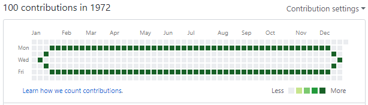

# GameOfGithubLife

Play [Conway's game of life](https://en.wikipedia.org/wiki/Conway%27s_Game_of_Life)
in Github. Each step is represented as a year in your contributions calendar.

## Examples

## Purpose

This gem has no purpose and does not solve any problem.
It's just another way to abuse previous date committing.

It's not a new idea to automatically create commits from the past,
here's similar projects I found:
- [gelstudios/gitfiti](https://github.com/gelstudios/gitfiti)
- [IonicaBizau/github-contributions](https://github.com/IonicaBizau/github-contributions)

## Installation

    $ gem install game_of_github_life

## Usage

Create a github repository.

Create local git repository and specify a remote.

    $ git init
    $ git remote add origin git@github.com:your_github_account/your_repository.git

Start game. Specify local path to repository (`.`) and ending year (`2008`).
The game will start playing from 1970. It will end before ending year.

    $ game_of_github_life . 2008

Wait until the script prints `done`.

See your contribution history from 1970.

## Contributing

Bug reports and pull requests are welcome on GitHub at https://github.com/past-one/game_of_github_life.

## License

The gem is available as open source under the terms of the [MIT License](https://opensource.org/licenses/MIT).
